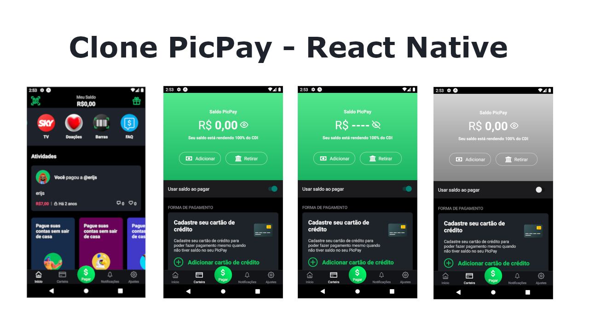

<h4 align="center">
 
 <b>Clone PicPay com React Native</b>
</h4>

 

### Princial objetivo

- Aprender na prática a como estilizar interfaces usando styled-components

### Tecnologias usadas

- [Expo](https://expo.io/);
- [React](https://pt-br.reactjs.org/);
- [React Native](https://reactnative.dev/);
- [Styled Components](https://styled-components.com/);

### Referência

- https://youtu.be/0CraBZHejKI
- https://www.instagram.com/imateus.silva/;

### Próximos desafios

- Implementar o restantes das telas: "Pagar", "Notificações", "Configurções".
